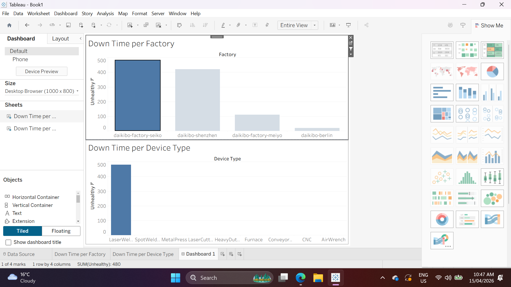

# Deloitte Australia — Data Analytics & Forensic Technology

> Factory telemetry dashboarding (Tableau) and forensic pay equity classification (Excel) for a consulting engagement.
> Completed as part of the **Deloitte Australia Data Analytics Job Simulation** on Forage.


---

## 📌 Project Summary

A mid-sized Japanese machinery manufacturer (Daikibo) engaged Deloitte's Analytics & Forensic Technology practice for two pieces of work:

1. **Operational analytics:** analyse IoT telemetry from 160,000+ device readings across 4 factories and 9 device types to pinpoint where downtime actually happens.
2. **Forensic HR analytics:** classify gender pay equity scores across every factory/role combination to surface discriminative pay patterns.

Two small tasks. Two completely different disciplines. One end goal: **insights non-technical stakeholders can act on tomorrow.**

---

## 🎯 Key Findings

### Task 1 — Machine Downtime Analysis

| Metric | Value |
|---|---|
| Total records analysed | 160,704 telemetry readings |
| Total downtime (all factories) | **1,030 minutes** |
| Factory with most downtime | **Daikibo Factory Seiko — 480 minutes** |
| Device type responsible | **LaserWelder — 100% of Seiko's downtime** |

**Commercial insight:** This is not a fleet-wide reliability problem. It's a single-device-type issue in a single factory. A targeted LaserWelder maintenance intervention at Seiko would eliminate ~47% of total downtime across all four facilities.

### Task 2 — Pay Equity Classification

Applied a three-tier classification to 37 factory × job-role combinations:

| Equality Score Range | Classification | Interpretation |
|---|---|---|
| -10 to +10 | **Fair** | Within acceptable bounds |
| <-10 or >10 (but within ±20) | **Unfair** | Requires HR review |
| <-20 or >20 | **Highly Discriminative** | Urgent: audit and remediation required |

Implemented via nested `IF` logic in Excel — deliberately transparent so HR leadership can audit the decision rule without a data analyst in the room.

---

## 📊 Dashboard Preview

The Tableau dashboard includes two linked bar charts with cross-filtering — clicking a factory in the top chart filters the device type breakdown below, enabling instant root-cause drilldown.



*Dashboard showing Factory Seiko selected — LaserWelder responsible for all 480 minutes of Seiko's downtime.*

---

## 🗂️ Repository Structure

```
deloitte-forensic-analytics/
├── README.md
├── task1-telemetry-dashboard/
│   ├── Daikibo_Dashboard.twbx                  # Tableau workbook (packaged)
│   ├── Daikibo_Dashboard.png                   # Dashboard screenshot submitted to Forage
│   └── notes.md                                # Calculated fields, filter actions, design choices
└── task2-pay-equity-classification/
    ├── Equality_Table_Completed.xlsx           # Final Excel file with live IF formulas
    └── notes.md                                # Classification rule, formula logic, edge-case handling
```

---

## 🛠️ Methodology

### Task 1 — Tableau Dashboard

1. Imported `daikibo-telemetry-data.json` (160,704 rows) with all schema levels flattened
2. Created calculated field `Unhealthy = IF [status] = "unhealthy" THEN 10 ELSE 0 END` (each unhealthy reading = 10 min of potential downtime)
3. Built two worksheets: `Down Time per Factory` and `Down Time per Device Type`, both sorted descending
4. Assembled into a dashboard with the Factory chart set as an interactive filter
5. Validated: SUM(Unhealthy) = 1,030 across both views, confirming data integrity

### Task 2 — Equality Classification

Single Excel formula, nested for clarity:

```excel
=IF(OR(C2<-20,C2>20), "Highly Discriminative",
  IF(OR(C2<-10,C2>10), "Unfair", "Fair"))
```

37 rows classified. Result distribution:

- **Fair:** 17 roles
- **Unfair:** 12 roles
- **Highly Discriminative:** 8 roles

---

## 🧰 Tech Stack

- **Tableau Desktop** — JSON data connection, calculated fields, dashboard actions
- **Microsoft Excel** — nested IF logic, conditional formatting
- **JSON / pandas** — data validation and cross-check in Python

---

## 📜 Certification

Completed as part of the [Deloitte Australia Data Analytics Job Simulation](https://www.theforage.com/simulations/deloitte-au/data-analytics-s5zy) hosted on Forage, April 2026.

---

## 👤 Author

**Ahmed Al Rafsan** — Data Analyst | MBIS (Data Analytics), AIH Melbourne

🔗 [LinkedIn](https://www.linkedin.com/in/ahmed-al-rafsan-/) · 💻 [GitHub](https://github.com/Ahmed-Al-Rafsan) · ▶️ [YouTube — Rafsan Data & AI Lab](https://www.youtube.com/@AhmedAlRafsan)


---

*This work is for portfolio and educational purposes only. No proprietary Deloitte or Daikibo data is redistributed.*
